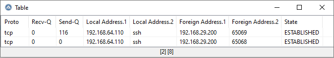

## Introduction

In AutoIt, we often have to deal with data structured like tables.
Depending on the source, we sometimes have to write a lot of code to convert the data into a form that we can continue working with.
Subsequently, working with this data is not necessarily any easier, as instead of accessing the descriptive names of the data attributes, we have to deal with numerical indices where it is very easy to lose track.

Both problems are addressed by the UDF.
In the basic approach, the UDF works with a table object (just an AutoIt map) in which the data is separated from the header.
This enables cleaner processing of the data.
It offers functions to read in data from various sources (CSV, array, string with fixed-width-columns, strings with their own column separators).
Within this call, the data is separated from the header or header data is added to it in the first place.
The data is then processed according to its format (with csv quotes and escapes removed, with fixed-width spaces removed...).
In addition, the user can define how exactly the data should be processed for each column individually. He is completely free to do this.
In this way, the data is already given the final format in which it is to be further processed when it is read in.

The data can then be handled on a column-based or attribute-based basis.
In other words, instead of using indices, the attribute names of the data can simply be used - this makes the code clearer.

## Example
We want to evaluate the open ports on a computer with AutoIt.
The command line command for this is `netstat -t` and gives us the following output:

```

Active Internet connections (w/o servers)

Proto Recv-Q Send-Q Local Address           Foreign Address         State
tcp        0    116 192.168.64.110:ssh      192.168.29.200:65069    ESTABLISHED
tcp        0      0 192.168.64.110:ssh      192.168.29.200:65068    ESTABLISHED
```
To continue processing the data in a meaningful way, we may need to carry out the following steps in AutoIt:

* Delete the first useless lines
* Extract the header row (it is treated differently from the data)
* Create an array with the correct dimension to hold the data
* Separate the data either by spaces or by fixed column widths
* Removal of unnecessary spaces from the data
* Converting the Recv-Q and Send-Q column to a numeric data type (for sorting etc.)
* Separation of address data into IP address and port

This can mean a lot of (error-prone) code effort.
With this UDF, however, you can solve the whole thing in a single call as follows:

```AutoIt
$sString = 'Active Internet connections (w/o servers)' & @CRLF & _
    '' & @CRLF & _
    'Proto Recv-Q Send-Q Local Address           Foreign Address         State' & @CRLF & _
    'tcp        0    116 192.168.64.110:ssh      192.168.29.200:65069    ESTABLISHED' & @CRLF & _
    'tcp        0      0 192.168.64.110:ssh      192.168.29.200:65068    ESTABLISHED'

; Transfer data to table type by using the size of every column:
Global $mData = _td_fromFixWidth($sString, _
                                 "left 6; Number 7; Number 7; StringSplit($x, ':', 2) 24;StringSplit($x, ':', 2) 24;", _ ; column definitions
                                 "1-2", _ ; skip row 1 to 2
								 True)

; display data
_td_display($mData)
```
and we get the result:


If you now use functions such as `_td_TableToMaps()`, you can process the individual data with expressions such as `$aData.Proto` or `$aData.State`. This should be much clearer than having to deal with array indices.

## Functions
| function | description |
| -------- | ----------- |
| <b>input</b> | |
| `_td_fromString`      | convert table-structured strings where the column separator can be described by a regular expression into a table object |
|  `_td_fromCsv`         | read strings with 2D-array-like data from a string where the rows and columns separated by separator-chars (e.g.: csv or tsv) |
|  `_td_fromFixWidth`    | read 2D-array-like data from a string where the columns have a fixed width (e.g. console outputs or printf-strings) |
|  `_td_fromArray`       | creates a table object from an existing 2D array |
| <b>output</b> | |
|  `_td_toCsv`           | convert a table object into a csv formatted string |
|  `_td_toFixWidth`      | convert a table object into a string where the columns has fixed width` |
|  `_td_display`         | present a table object like _ArrayDisplay |
|  `_td_toArray`         | creates an array from a table object |
| <b>Preparation of 2D arrays</b> | <b>for easy further processing</b> |
|  `_td_TableToMaps`     | converts a 2D-Array (rows=records, columns=values, column headers=keys) into a set of key-value maps (every record = key-value map)
|  `_td_TableToDics`     | converts a 2D-Array (rows=records, columns=values, column headers=keys) into a set of objects (every record = Dictionary with named attributes) |
|  `_td_MapsToTable`    | converts a map-array (a 1D-array with maps as values) into 2 2D-array where the colums = keys |
|  `_td_toColumns`       | convert 2D-array or table-data map from this udf into a map with column names as keys and their data as 1D-arrays |
|  `_td_getColumn`      | extract one or multiple colums from a 2D-Array or a table-data map |